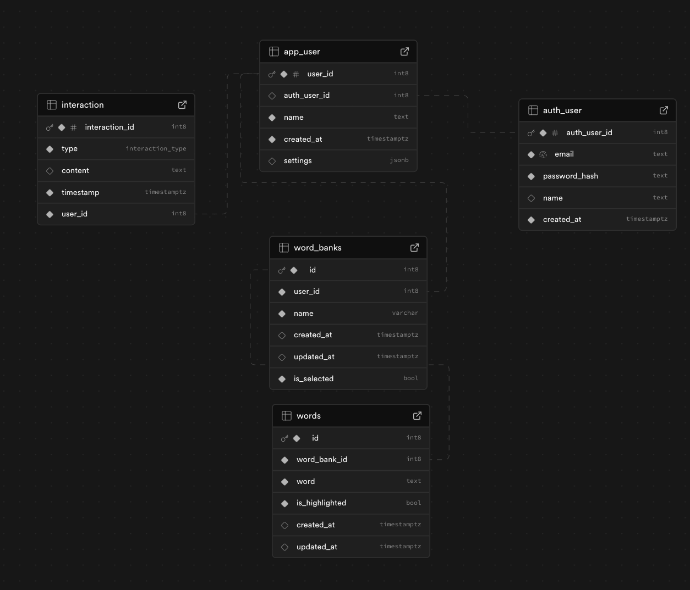
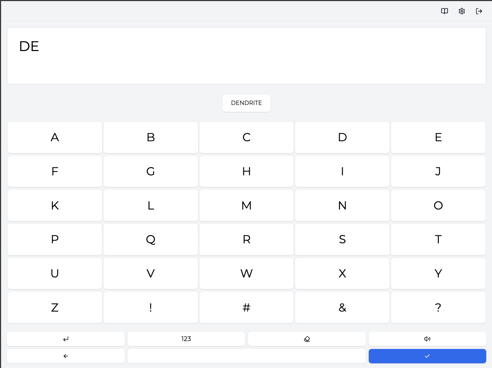
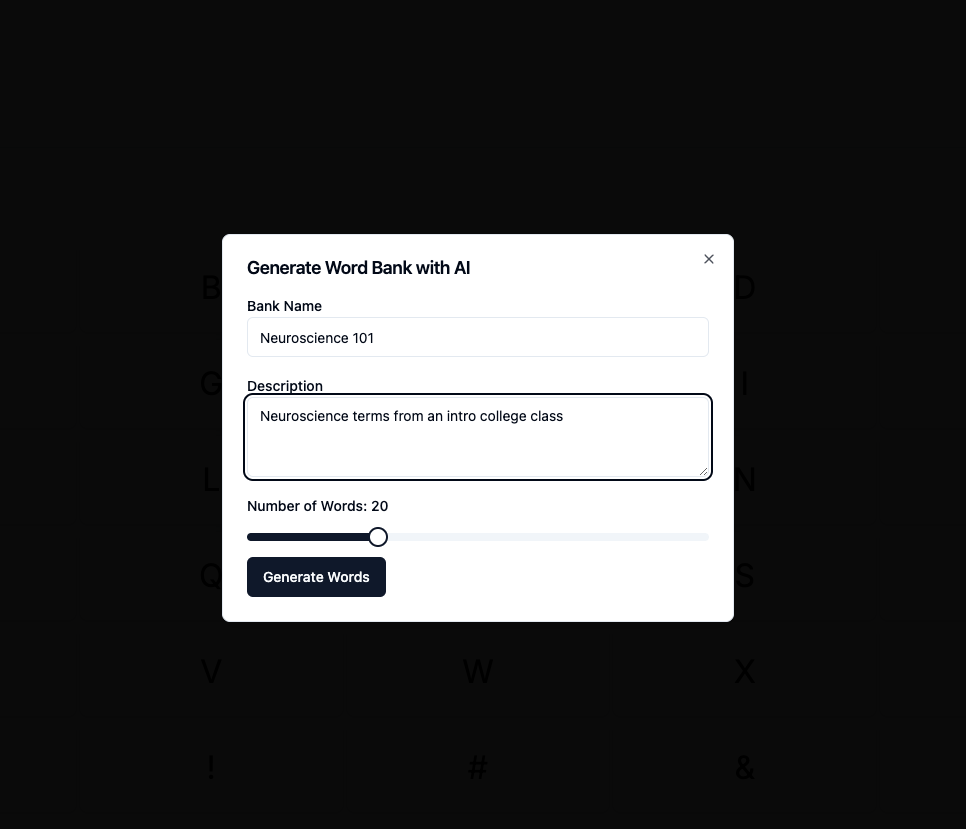
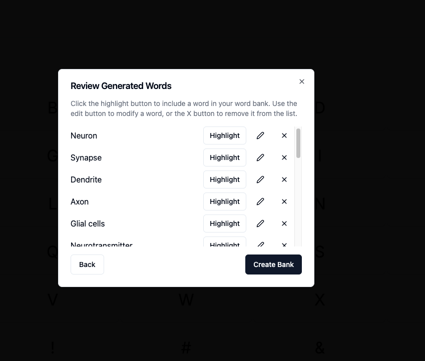
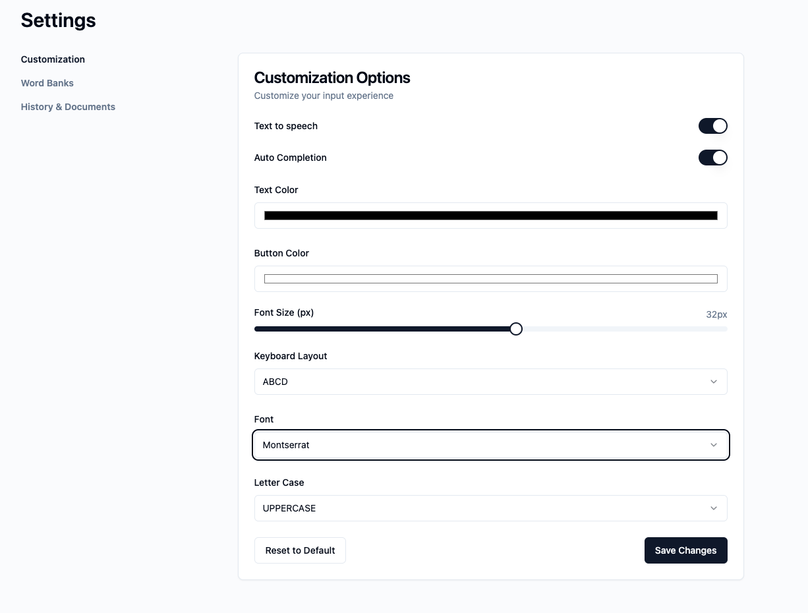

# AI-Assisted Communication (AAC) App

An AI-enabled communication assistance tool designed to empower autistic individuals and people with speech difficulties. Built with Next.js 14, Supabase, ElevenLabs, OpenAI & Posthog. 

## 🌎 Background

This project was inspired by my younger brother, who is autistic and uses AAC (Augmentative and Alternative Communication) tools to communicate effectively. While exploring existing AAC solutions, I noticed that many were expensive and cumbersome to use. This motivated me to create a more accessible, user-friendly alternative that leverages modern AI technology to enhance the communication experience.

The impact of AAC tools can be transformative - I've witnessed firsthand how access to better communication tools can help individuals progress academically and express themselves more fully. This project aims to make such tools more accessible to everyone who needs them.

## 🌟 Features

- **Smart Letter Board**: Intuitive typing interface optimized for accessibility
- **Advanced Voice Synthesis**: Integration with Eleven Labs and OpenAI for natural-sounding speech output, moving beyond traditional robotic AAC voices
- **Customizable Word Banks**: Parents can create topic-specific word banks (e.g., neuroscience terminology) for faster, more relevant communication
- **Predictive Text**: AI-powered contextual word suggestions using customized word banks
- **Document History**: Save and export conversations as PDFs for review and sharing
- **Customizable Interface**: Personalize the look and feel to match user preferences
- **Accessibility-First Design**: Built following WCAG guidelines

## Data Model



## ✨ Key Features

### Smart Communication Board
A simple, accessible keyboard interface with AI-powered text predictions. Users can type naturally while receiving intelligent word suggestions, making communication faster and more efficient. Integrated with ElevenLabs for natural-sounding text-to-speech output that moves beyond traditional robotic AAC voices.



### AI-Generated Word Banks
Create specialized vocabulary sets using AI. Perfect for specific contexts like academic subjects or special interests. For example, if a user needs terminology for "Neuroscience 101", the system can generate and store relevant terms, ensuring text predictions are perfectly tuned to their unique communication needs.





### Rich Customization
Personalize every aspect of the interface to match individual preferences and needs. Adjust colors, layouts, and interaction styles to create the most comfortable and effective communication environment for each user.



## 💻 Tech Stack

- **Frontend**: Next.js 14, TypeScript, TailwindCSS, Zustand
- **Backend**: Next.js API Routes, Server Actions
- **Database**: Supabase with SDK
- **AI Integration**: OpenAI API
- **Voice Synthesis**: Eleven Labs API
- **Analytics**: PostHog (User analytics + Session replays)
- **Deployment**: Vercel

## 🛠️ Getting Started

1. Clone the repository:
```bash
git clone git@github.com:rgb-prithvi/ai-letterboard.git
```

2. Install dependencies:
```bash
npm install
# or
yarn install
```

3. Set up environment variables:
```bash
cp .env.example .env.local
```

4. Run the development server:
```bash
npm run dev
# or
yarn dev
```

Open [http://localhost:3000](http://localhost:3000) to view the app.

---
Built with ❤️ for accessibility and inclusion
