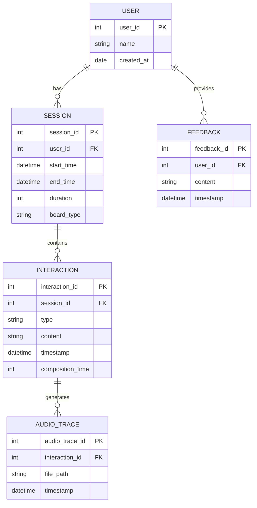

# Communication App Data Model Summary

## Overview

This document outlines the data model for a communication app designed to assist users with autism in typing and speaking words and phrases. The model is designed to efficiently capture user interactions, session data, and feedback while maintaining simplicity and ease of use.

## Entity Relationship Diagram

## Table Definitions

### USER

Stores basic information about each user of the app.

| Column      | Type   | Description                           |
|-------------|--------|---------------------------------------|
| user_id     | int    | Primary key, unique identifier for user |
| name        | string | User's name                           |
| created_at  | date   | Date when the user account was created |

### SESSION

Represents a single usage session of the app.

| Column      | Type     | Description                           |
|-------------|----------|---------------------------------------|
| session_id  | int      | Primary key, unique identifier for session |
| user_id     | int      | Foreign key referencing USER table    |
| start_time  | datetime | When the session started              |
| end_time    | datetime | When the session ended                |
| duration    | int      | Duration of the session in seconds    |
| board_type  | string   | Type of board used (keyboard/word board) |

### INTERACTION

Captures various types of user interactions within a session.

| Column           | Type     | Description                           |
|------------------|----------|---------------------------------------|
| interaction_id   | int      | Primary key, unique identifier for interaction |
| session_id       | int      | Foreign key referencing SESSION table |
| type             | string   | Type of interaction (e.g., button_press, word_selection, message_completion) |
| content          | string   | Content of the interaction (e.g., button pressed, word selected, message composed) |
| timestamp        | datetime | When the interaction occurred         |
| composition_time | int      | Time taken to compose (for messages)  |

### AUDIO_TRACE

Stores references to audio files generated by the text-to-speech AI.

| Column         | Type     | Description                           |
|----------------|----------|---------------------------------------|
| audio_trace_id | int      | Primary key, unique identifier for audio trace |
| interaction_id | int      | Foreign key referencing INTERACTION table |
| file_path      | string   | Path or URL to the stored audio file  |
| timestamp      | datetime | When the audio was generated          |

### FEEDBACK

Captures user feedback and notes.

| Column      | Type     | Description                           |
|-------------|----------|---------------------------------------|
| feedback_id | int      | Primary key, unique identifier for feedback |
| user_id     | int      | Foreign key referencing USER table    |
| content     | string   | Content of the feedback               |
| timestamp   | datetime | When the feedback was provided        |

## Relationships

1. A USER can have multiple SESSIONs (one-to-many)
2. A SESSION can have multiple INTERACTIONs (one-to-many)
3. An INTERACTION can generate multiple AUDIO_TRACEs (one-to-many)
4. A USER can provide multiple FEEDBACK entries (one-to-many)

This data model allows for efficient tracking of user interactions, session data, and feedback while maintaining a simple and easy-to-query structure.