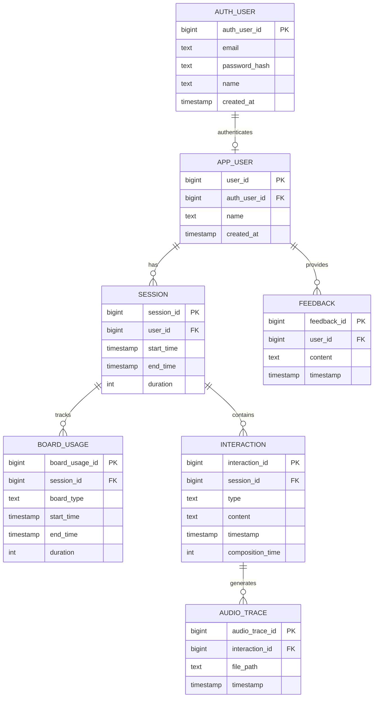

# Communication App Data Model Summary

## Overview

This document outlines the updated data model for a communication app designed to assist users with autism in typing and speaking words and phrases. The model is designed to efficiently capture user interactions, session data, and feedback while maintaining simplicity and ease of use.

## Entity Relationship Diagram

## Table Definitions

### AUTH_USER

Stores authentication information for users.

| Column         | Type      | Description                           |
|----------------|-----------|---------------------------------------|
| auth_user_id   | bigint    | Primary key, unique identifier for auth user |
| email          | text      | User's email address (unique)         |
| password_hash  | text      | Hashed password for authentication    |
| name           | text      | User's name (optional)                |
| created_at     | timestamp | When the auth user was created        |

### APP_USER

Stores basic information about each user of the app.

| Column         | Type      | Description                           |
|----------------|-----------|---------------------------------------|
| user_id        | bigint    | Primary key, unique identifier for user |
| auth_user_id   | bigint    | Foreign key referencing AUTH_USER table |
| name           | text      | User's name                           |
| created_at     | timestamp | When the user account was created     |

### SESSION

Represents a single usage session of the app.

| Column      | Type      | Description                           |
|-------------|-----------|---------------------------------------|
| session_id  | bigint    | Primary key, unique identifier for session |
| user_id     | bigint    | Foreign key referencing APP_USER table |
| start_time  | timestamp | When the session started              |
| end_time    | timestamp | When the session ended                |
| duration    | int       | Duration of the session in seconds    |

### BOARD_USAGE

Tracks the usage of different board types within a session.

| Column         | Type      | Description                           |
|----------------|-----------|---------------------------------------|
| board_usage_id | bigint    | Primary key, unique identifier for board usage |
| session_id     | bigint    | Foreign key referencing SESSION table |
| board_type     | text      | Type of board used (e.g., keyboard, word board) |
| start_time     | timestamp | When the board usage started          |
| end_time       | timestamp | When the board usage ended            |
| duration       | int       | Duration of the board usage in seconds |

### INTERACTION

Captures various types of user interactions within a session.

| Column           | Type      | Description                           |
|------------------|-----------|---------------------------------------|
| interaction_id   | bigint    | Primary key, unique identifier for interaction |
| session_id       | bigint    | Foreign key referencing SESSION table |
| type             | text      | Type of interaction (e.g., button_press, word_selection, message_completion) |
| content          | text      | Content of the interaction (e.g., button pressed, word selected, message composed) |
| timestamp        | timestamp | When the interaction occurred         |
| composition_time | int       | Time taken to compose (for messages)  |

### AUDIO_TRACE

Stores references to audio files generated by the text-to-speech AI.

| Column         | Type      | Description                           |
|----------------|-----------|---------------------------------------|
| audio_trace_id | bigint    | Primary key, unique identifier for audio trace |
| interaction_id | bigint    | Foreign key referencing INTERACTION table |
| file_path      | text      | Path or URL to the stored audio file  |
| timestamp      | timestamp | When the audio was generated          |

### FEEDBACK

Captures user feedback and notes.

| Column      | Type      | Description                           |
|-------------|-----------|---------------------------------------|
| feedback_id | bigint    | Primary key, unique identifier for feedback |
| user_id     | bigint    | Foreign key referencing APP_USER table |
| content     | text      | Content of the feedback               |
| timestamp   | timestamp | When the feedback was provided        |

## Relationships

1. An AUTH_USER can authenticate one APP_USER (one-to-one)
2. An APP_USER can have multiple SESSIONs (one-to-many)
3. A SESSION can have multiple BOARD_USAGEs (one-to-many)
4. A SESSION can have multiple INTERACTIONs (one-to-many)
5. An INTERACTION can generate multiple AUDIO_TRACEs (one-to-many)
6. An APP_USER can provide multiple FEEDBACK entries (one-to-many)

This updated data model allows for efficient tracking of user authentication, interactions, session data, board usage, and feedback while maintaining a simple and easy-to-query structure.